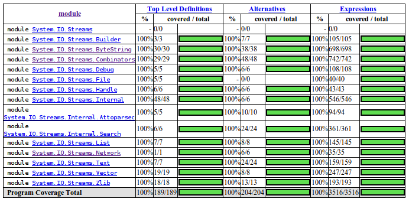

| title: Announcing: first release of io-streams
| author: Gregory Collins <greg@gregorycollins.net>
| published: 2013-03-05T22:59:00+0100
| updated:   2013-03-05T22:59:00+0100
| summary: Announcing the first release of io-streams, a simple and easy-to-use library for doing streaming I/O in Haskell.

After more than eight months of careful design and development, The Snap
Framework team is happy to announce the first version of
[`io-streams`](http://hackage.haskell.org/package/io-streams), a simple and
easy-to-use library for doing streaming I/O in Haskell.

The `io-streams` library is based around two basic types, `InputStream a` and
`OutputStream a`, and three fundamental I/O primitives:

~~~~~~~~~~ {.haskell}
-- read an item from an input stream
read :: InputStream a -> IO (Maybe a)

-- push an item back to an input stream
unRead :: a -> InputStream a -> IO ()

-- write to an output stream
write :: Maybe a -> OutputStream a -> IO ()
~~~~~~~~~~

Streams can be transformed by composition and hooked together with a large set
of provided combinators:

~~~~~~~~~~ {.sourceCode}
ghci> Streams.fromList [1,2,3::Int] >>= Streams.map (*10) >>= Streams.toList
[10,20,30]
~~~~~~~~~~

Stream composition leaves the original stream accessible:

~~~~~~~~~~ {.sourceCode}
ghci> input <- Streams.fromByteString "long string"
ghci> wrapped <- Streams.takeBytes 4 input
ghci> read wrapped
Just "long"
ghci> read wrapped
Nothing
ghci> read input
Just " string"
~~~~~~~~~~

Simple types and operations in the `IO` monad mean straightforward and simple
exception handling and resource cleanup using Haskell standard library
functions like `bracket`.

The `io-streams` library comes with:

 * functions to use files, handles, concurrent channels, sockets, lists,
   vectors, and more as streams.
 * a plethora of combinators for wrapping and transforming streams, including
   compression and decompression using `zlib`, controlling precisely how many
   bytes are read from or written to a stream, buffering output using
   bytestring builders, folds, maps, filters, zips, etc.
 * support for parsing from streams using
   [attoparsec](http://hackage.haskell.org/package/attoparsec).

For first-time users, `io-streams` comes with an included tutorial in the
`System.IO.Streams.Tutorial` module, written by
[Gabriel Gonzalez](http://www.haskellforall.com/) of
"[pipes](http://hackage.haskell.org/package/pipes)" fame.

The `io-streams` library is tested on GHC 7.0, 7.2, 7.4, and 7.6, and includes
an extensive test suite with 100% function, statement, and branch coverage:

The `io-streams` library was written to serve as the I/O subsystem underpinning
the next release of the Snap Framework web programming library and server. It
also serves as the basis behind the excellent new
[http-streams](https://github.com/afcowie/http-streams) HTTP client
library written by
[Andrew Cowie](http://blogs.operationaldynamics.com/andrew/), which will also
be released shortly, along with the
[openssl-streams](http://hackage.haskell.org/package/openssl-streams) for
interfacing [HsOpenSSL](http://hackage.haskell.org/package/HsOpenSSL) with
`io-streams`.

## Frequently asked questions

*Q.* Why yet another library for doing streaming I/O? Aren't
iteratees/pipes/conduits enough?

*A.* There are two motivating differentiators that led me to write `io-streams`:
the other libraries were too difficult to understand, and their use of
continuation-passing style interacts badly with asynchronous exceptions.

*Q.* What is the resource-handling strategy used by `io-streams`?

*A.* In nearly all cases, resources (`Socket`s, `Handle`s, etc.) are not managed
directly by `io-streams`. You can think of an `InputStream` as a little state
machine that you attach to an underlying resource. Instead, you can use
standard Haskell exception-handling strategies like `bracket` to acquire
resources, hand them to `io-streams`, perform streaming computations, and then
clean up afterwards.

Since you manage resources and everything happens in a direct style in the `IO`
monad, you can be sure that e.g. opening a temporary file halfway through a
streaming computation and cleaning it up using `bracket` is always
exception-safe.

*Q.* Why isn't `io-streams` written in monad transformer style?

*A.* A couple of reasons:

 * to keep the library as simple as possible. Even beginners should be able to
   understand and use `io-streams` without too much trouble.
 * I'm coming to the conclusion in my own code that monad transformers are OK
   in small doses, but are often overused, especially where very large monad
   transformer stacks are concerned. Each level added to a monad transformer
   stack is a performance tax on every line of every monadic function.

I realize that this may make `io-streams` inappropriate for use with resources
that have operations in some other monad lifted over `IO`; I'm more than happy
with this compromise.

## Acknowledgements

We would like to acknowledge the financial assistance of
[Erudify AG](https://erudify.ch/about/), who graciously funded some of the
documentation and development of the `io-streams` library. Many thanks are also
due to Gabriel Gonzalez, Andrew Cowie,
[Johan Tibell](http://blog.johantibell.com/), and
[Bas van Dijk](https://github.com/basvandijk) for their helpful discussions,
contributions, and review.
